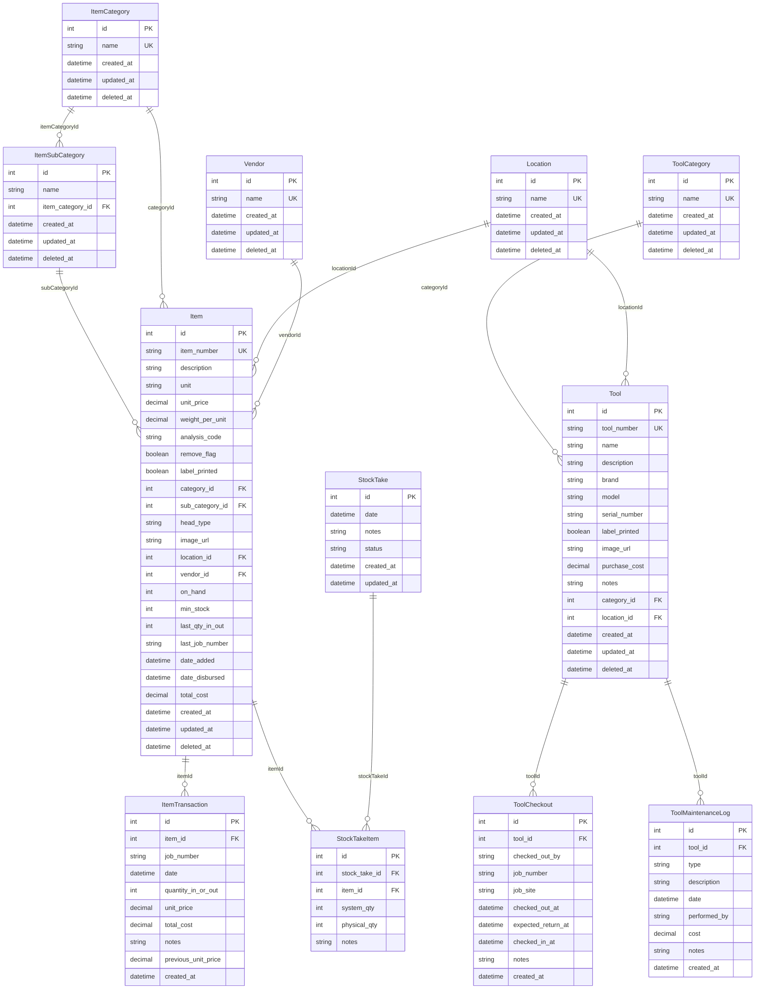

# Database Schema

```mermaid
erDiagram
  Vendor {
    int id PK
    string name UK
    datetime created_at
    datetime updated_at
    datetime deleted_at
  }

  Location {
    int id PK
    string name UK
    datetime created_at
    datetime updated_at
    datetime deleted_at
  }

  ItemCategory {
    int id PK
    string name UK
    datetime created_at
    datetime updated_at
    datetime deleted_at
  }

  ItemSubCategory {
    int id PK
    string name
    int item_category_id FK
    datetime created_at
    datetime updated_at
    datetime deleted_at
  }

  Item {
    int id PK
    string item_number UK
    string description
    string unit
    decimal unit_price
    decimal weight_per_unit
    string analysis_code
    boolean remove_flag
    boolean label_printed
    int category_id FK
    int sub_category_id FK
    string head_type
    string image_url
    int location_id FK
    int vendor_id FK
    int on_hand
    int min_stock
    int last_qty_in_out
    string last_job_number
    datetime date_added
    datetime date_disbursed
    decimal total_cost
    datetime created_at
    datetime updated_at
    datetime deleted_at
  }

  ItemTransaction {
    int id PK
    int item_id FK
    string job_number
    datetime date
    int quantity_in_or_out
    decimal unit_price
    decimal total_cost
    string notes
    decimal previous_unit_price
    datetime created_at
  }

  StockTake {
    int id PK
    datetime date
    string notes
    string status
    datetime created_at
    datetime updated_at
  }

  StockTakeItem {
    int id PK
    int stock_take_id FK
    int item_id FK
    int system_qty
    int physical_qty
    string notes
  }

  ToolCategory {
    int id PK
    string name UK
    datetime created_at
    datetime updated_at
    datetime deleted_at
  }

  Tool {
    int id PK
    string tool_number UK
    string name
    string description
    string brand
    string model
    string serial_number
    boolean label_printed
    string image_url
    decimal purchase_cost
    string notes
    int category_id FK
    int location_id FK
    datetime created_at
    datetime updated_at
    datetime deleted_at
  }

  ToolCheckout {
    int id PK
    int tool_id FK
    string checked_out_by
    string job_number
    string job_site
    datetime checked_out_at
    datetime expected_return_at
    datetime checked_in_at
    string notes
    datetime created_at
  }

  ToolMaintenanceLog {
    int id PK
    int tool_id FK
    string type
    string description
    datetime date
    string performed_by
    decimal cost
    string notes
    datetime created_at
  }

  %% Relationships — Reference Data
  Vendor       ||--o{ Item             : "vendorId"
  Location     ||--o{ Item             : "locationId"
  Location     ||--o{ Tool             : "locationId"
  ItemCategory ||--o{ ItemSubCategory  : "itemCategoryId"
  ItemCategory ||--o{ Item             : "categoryId"
  ItemSubCategory ||--o{ Item          : "subCategoryId"

  %% Relationships — Items Domain
  Item         ||--o{ ItemTransaction  : "itemId"
  StockTake    ||--o{ StockTakeItem    : "stockTakeId"
  Item         ||--o{ StockTakeItem    : "itemId"

  %% Relationships — Tools Domain
  ToolCategory ||--o{ Tool             : "categoryId"
  Tool         ||--o{ ToolCheckout     : "toolId"
  Tool         ||--o{ ToolMaintenanceLog : "toolId"
```

## Legend

| Notation | Meaning |
|----------|---------|
| `PK` | Primary Key |
| `UK` | Unique Key |
| `FK` | Foreign Key |
| `||--o{` | One-to-many (parent -- child) |
